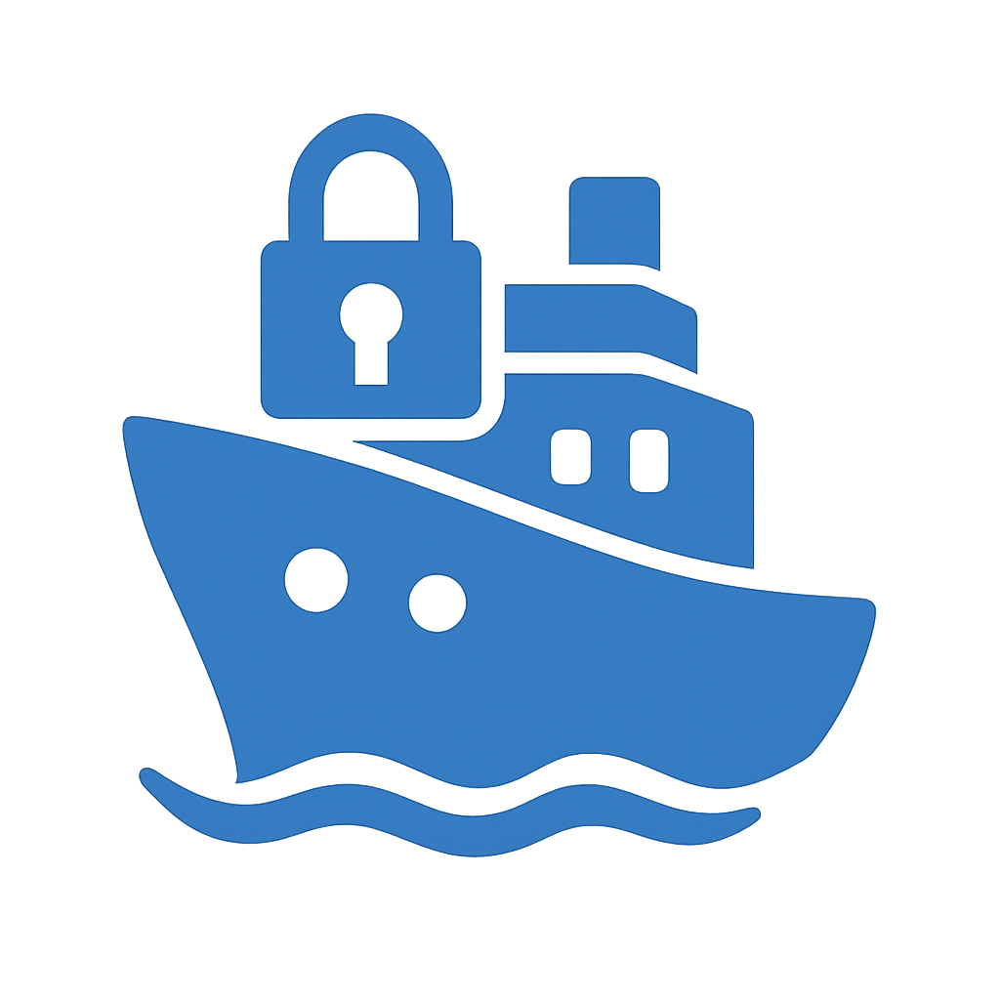

<div align="right">
  <a href="https://github.com/lambda0x63/sship">GitHub</a> | 
  <a href="https://github.com/lambda0x63/sship/pkgs/container/sship">GitHub Packages</a>
</div>

<div align="center">
  <br/>
  
  <h1>sship</h1>
  <p><b>Streamlined Self-Hosting Infrastructure Platform</b></p>
  <p>Docker 및 SSH 기반의 경량형 CD 및 원격 서버 관리 도구</p>
  <br/>
</div>

<hr/>

## Overview

Docker 기반 배포를 위한 경량 CI/CD 오케스트레이션 도구. 별도의 에이전트 설치 없이 SSH 기반 원격 실행을 통해 원클릭으로 VPS에 애플리케이션을 배포하고 관리할 수 있습니다.

<br/>

## Key Features

- **SSH-based Deployment**: 에이전트리스 방식의 보안 원격 명령어 실행 및 배포.
- **Real-time Monitoring**: WebSocket 및 SSE를 활용한 실시간 로그 스트리밍 및 배포 상태 추적.
- **Multi-project Management**: 하나의 대시보드에서 다중 서버 및 프로젝트 통합 관리.
- **Git-based Rollback**: 배포 히스토리를 통한 즉각적인 이전 버전 복구 지원.
- **Zero-downtime Approach**: Docker Compose 오케스트레이션을 통한 유연한 서비스 갱신.

<br/>

## Quick Start

1. 현재 디렉토리에 `sship.yaml` 파일 생성 및 설정.
2. Docker 컨테이너 실행
```bash
docker run -d \
  --name sship \
  -p 9999:9999 \
  -v $(pwd)/sship.yaml:/app/sship.yaml \
  ghcr.io/lambda0x63/sship:latest
```
3. `http://localhost:9999` 접속 후 배포 버튼 클릭.

<br/>

## Configuration (`sship.yaml`)

| Property | Type | Default | Description |
|:---|:---:|:---:|:---|
| `projects` | `map` | `{}` | 관리할 프로젝트 목록 |
| `server.host` | `string` | `""` | 대상 서버 VPS 호스트 주소 |
| `server.user` | `string` | `"root"` | SSH 접속 계정 |
| `path` | `string` | `""` | 서버 내 프로젝트 작업 경로 |
| `branch` | `string` | `"main"` | 배포 대상 Git 브랜치 |
| `docker_compose` | `string` | `"docker-compose.prod.yml"` | 실행할 컴포즈 파일명 |

<br/>

## Tech Stack

- **Backend**: Go 1.23 & Gin Web Framework.
- **Frontend**: Tailwind CSS & Alpine.js (Lightweight UI).
- **Orchestration**: Docker Compose & SSH (crypto/ssh).
- **Communication**: WebSocket & SSE (Real-time updates).

<br/>

<hr/>

<div align="center">
  <p>Produced by <b>lambda0x63</b></p>
  <p><a href="LICENSE">MIT License</a></p>
</div>